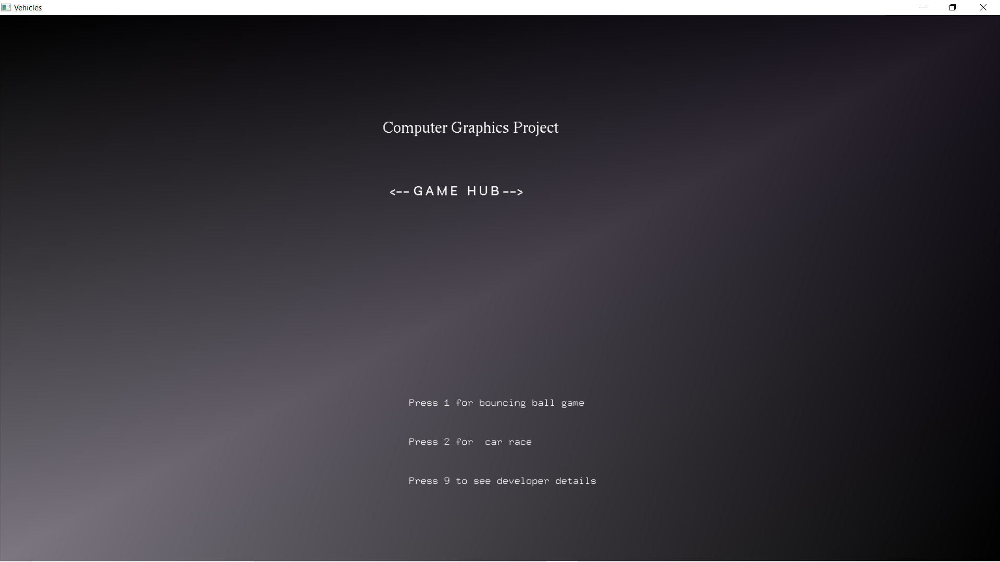
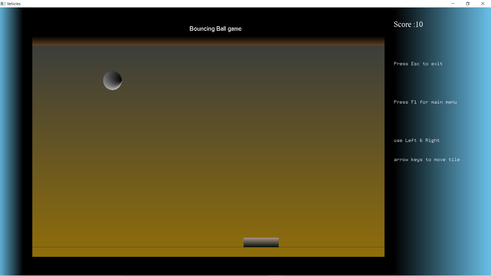
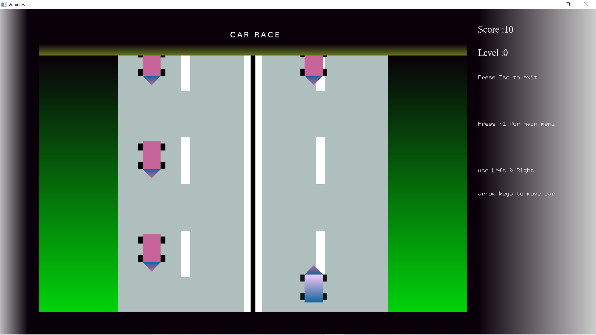

<!DOCTYPE html>
<html lang="en">
    <head>
        <meta charset="utf-8" />
        <meta name="viewport" content="width=device-width, initial-scale=1, shrink-to-fit=no" />
        <meta name="description" content="" />
        <meta name="author" content=" Ganesha k S" />
        <title>GANESHA K S PORTFOLIO</title>
        <link rel="icon" type="image/x-icon" href="assets/img/favicon.ico" />
        <!-- Font Awesome icons (free version)-->
        
        <!-- Google fonts-->
        <link href="https://fonts.googleapis.com/css?family=Varela+Round" rel="stylesheet" />
        <link href="https://fonts.googleapis.com/css?family=Nunito:200,200i,300,300i,400,400i,600,600i,700,700i,800,800i,900,900i" rel="stylesheet" />
        <!-- Core theme CSS (includes Bootstrap)-->
        <link href="css/styles.css" rel="stylesheet" />
    </head>
    <body id="page-top">
        <!-- Navigation-->
        <nav class="navbar navbar-expand-lg navbar-light fixed-top" id="mainNav">
            

                <a class="navbar-brand js-scroll-trigger" href="#page-top">Ganesha K S</a>
                <button class="navbar-toggler navbar-toggler-right" type="button" data-toggle="collapse" data-target="#navbarResponsive" aria-controls="navbarResponsive" aria-expanded="false" aria-label="Toggle navigation">
                    Menu
                    <i class="fas fa-bars"></i>
                </button>
                

                    <ul class="navbar-nav ml-auto">
                        <li class="nav-item"><a class="nav-link js-scroll-trigger" href="#home">About</a></li>
                        <li class="nav-item"><a class="nav-link js-scroll-trigger" href="#qualification">Qualification</a></li>
                        <li class="nav-item"><a class="nav-link js-scroll-trigger" href="#projects">Projects</a></li>
                        <li class="nav-item"><a class="nav-link js-scroll-trigger" href="#signup">Contact</a></li>
                    </ul>
                

            

        </nav>
        <!-- Masthead-->
        <header class="masthead">
            

                

                    <h1 class="mx-auto my-0 text-uppercase">GANESHA K S</h1>
                    <h2 class="text-white-50 mx-auto mt-2 mb-5">Try to create your own happiness,Don't depend on others
                    </h2>
                    <a class="btn btn-primary js-scroll-trigger" href="#qualification">See Details</a>
                

            

        </header>
        <!-- qulifications-->
        <section class="about-section text-center" id="qualification">
            

                

                    

                        

                            

                                

                                    

                                        

                                          
                                            <h4 class="text-uppercase m-0">B.E in  Compter Science</h4>
                                            

                                            
Shri Madhwa Vadiraja Institute Of Technology And Management(2017-2021)

                                        

                                    

                                

                                

                                    

                                        

                                            <h4 class="text-uppercase m-0">Pre-University Education </h4>
                                            

                                            
Shri Ramakunjeshwara Pre-University College (2015-2017)

                                        

                                    

                                

                                

                                    

                                        

                                            <h4 class="text-uppercase m-0">Secondary School Education</h4>
                                            

                                            
Government HighSchool Masur(2015-2017)

                                        

                                    

                                

                            

                            

                                

                                    

                                        

                                          
                                            <!-- <h4 class="text-uppercase m-0">B.E in  Compter Science</h4>
                                            

                                            
Shri Madhwa Vadiraja Institute Of Technology And Management(2017-2021)

                                            
 -->
                                            

                                            

                                                     

                                                         

                                                          <h4 class="text-uppercase m-0">HTML  80%</h4>
                                                         

                                                      

                                    
                                          
                                          
                                                     

                                                         
 
                                                             <h4 class="text-uppercase m-0">CSS  75%</h4>
                                                          

                                                     

                                            
                                            

                                             
                                            

                                            

                                                

                                                    

                                                     <h4 class="text-uppercase m-0">C  70%</h4>
                                                    

                                                 

                               
                                     
                                     
                                                

                                                    
 
                                                        <h4 class="text-uppercase m-0">C++  80%</h4>
                                                     

                                                

                                       
                                            

                                             
                                            

                                            

                                                

                                                    

                                                     <h4 class="text-uppercase m-0">java  80%</h4>
                                                    

                                                 

                               
                                     
                                     
                                                

                                                    
 
                                                        <h4 class="text-uppercase m-0">python  80%</h4>
                                                     

                                                

                                       
                                            

                                                                       
                                      

                                       
    
                                    

                                

                               
                            

                         
                         

                     

                <!--  -->
              

            

       </section>
        <!-- Projects-->
        <section class="projects-section bg-light" id="projects">
            

                <!-- Featured Project Row-->
                <!-- 

                    

                    

                        

                            <h4>Shoreline</h4>
                            
Grayscale is open source and MIT licensed. This means you can use it for any project - even commercial projects! Download it, customize it, and publish your website!

                        

                    

                
 -->
                <!-- Project One Row-->
                

                    

                        <!-- 
 -->
                        

                            <ol class="carousel-indicators">
                              <li data-target="#carouselExampleIndicators" data-slide-to="0" class="active"></li>
                              <li data-target="#carouselExampleIndicators" data-slide-to="1"></li>
                            </ol>
                            

                              

                                
                              

                              

                                
                              

                              

                            <a class="carousel-control-prev" href="#carouselExampleIndicators" role="button" data-slide="prev">
                              
                              Previous
                            </a>
                            <a class="carousel-control-next" href="#carouselExampleIndicators" role="button" data-slide="next">
                              
                              Next
                            </a>
                          

                    

                    
                       
                    

                        

                            

                                

                                    <h4 class="text-white">RTO MANAGEMENT SYSTEM(2019)</h4>
                                    <h5 class="text-white"> Tech Stack : C# , SQL</h5>
                                    
This project idea is to develop a system which reduces a lot of paper works in Regional Transport Office.

                                    

                                

                            

                        

                    

                

                <!-- Project Two Row-->
                

                    
 
                        
                         <!--  -->
                         

                            <ol class="carousel-indicators">
                              <li data-target="#carouselExampleIndicators" data-slide-to="0" class="active"></li>
                              <li data-target="#carouselExampleIndicators" data-slide-to="1"></li>
                              <li data-target="#carouselExampleIndicators" data-slide-to="2"></li>
                            </ol>
                            

                              

                                
                              

                              

                                
                              

                              

                                
                              

                            

                            <a class="carousel-control-prev" href="#carouselExampleIndicators" role="button" data-slide="prev">
                              
                              Previous
                            </a>
                            <a class="carousel-control-next" href="#carouselExampleIndicators" role="button" data-slide="next">
                              
                              Next
                            </a>
                          

                    

                    
                        
                    

                        

                            

                                

                                    <h4 class="text-white">GAME HUB(2020)</h4>
                                    <h5 class="text-white"> Tech Stack : OpenGL</h5>
                                    
In this project we developed two games namely Brick&Ball and Cargame Project is built using OpenGL ,there was a option for selecting game and goes on harder as we go to higher level.

                                   

                                

                            

                        

                    

                

            

        </section>
        <!-- Signup-->
        <section class="signup-section" id="signup">
            

                

                    

                        <i class="far fa-paper-plane fa-2x mb-2 text-white"></i>
                        <h2 class="text-white mb-5">Get in Touch</h2>
                        <form class="form-inline d-flex"  method="POST" action="https://formspree.io/ganesks439@gmail.com">
                            
                                    <input type="hidden"  class="form-control flex-fill mr-0 mr-sm-2 mb-3 mb-sm-0" name="_subject" value="Contact request from personal website" />
                                    <input type="email"  class="form-control flex-fill mr-0 mr-sm-2 mb-3 mb-sm-0"  name="_replyto" placeholder="Your email" required>
                                    <textarea name="message" class="form-control flex-fill mr-0 mr-sm-2 mb-3 mb-sm-0" placeholder="Your message" required></textarea>
                                    <button class="btn btn-primary mx-auto" type="submit">Send</button>
                    
                        </form>
                    

                

            

        </section>
        <!-- Contact-->
        <section class="contact-section bg-black">
            

                

                    

                        

                            

                                <i class="fas fa-map-marked-alt text-primary mb-2"></i>
                                <h4 class="text-uppercase m-0">Address</h4>
                                

                                
Keladi sagara-577401

                            

                        

                    

                    

                        

                            

                                <i class="fas fa-envelope text-primary mb-2"></i>
                                <h4 class="text-uppercase m-0">Email</h4>
                                

                                
<a href="#!">Ganeshks439@gmail.com</a>

                            

                        

                    

                    

                        

                            

                                <i class="fas fa-mobile-alt text-primary mb-2"></i>
                                <h4 class="text-uppercase m-0">Phone</h4>
                                

                                
+91 9663520531

                            

                        

                    

                

                

                    <a class="mx-2" href="https://www.linkedin.com/in/ganesh-k-s-b4a59a14b"><i class="fab fa-linkedin-in"></i></a>
                    <a class="mx-2" href="https://m.facebook.com/ganesha.ks.7399"><i class="fab fa-facebook-f"></i></a>
                    <a class="mx-2" href="https://github.com/GANESHAKS"><i class="fab fa-github"></i></a>
                

            

        </section>
        <!-- Footer-->
        <footer class="footer bg-black small text-center text-white-50">
Copyright © boogeytech.in 2020
</footer>
        <!-- Bootstrap core JS-->
        
        
        <!-- Third party plugin JS-->
        
        <!-- Core theme JS-->
        
    </body>
</html>
